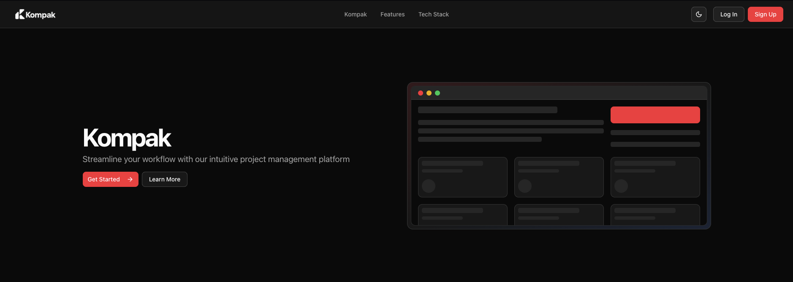
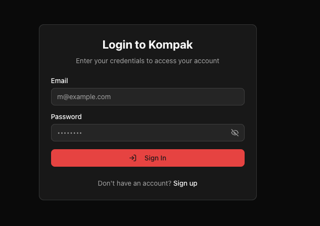
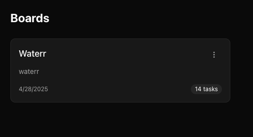
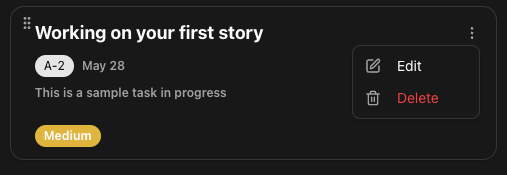
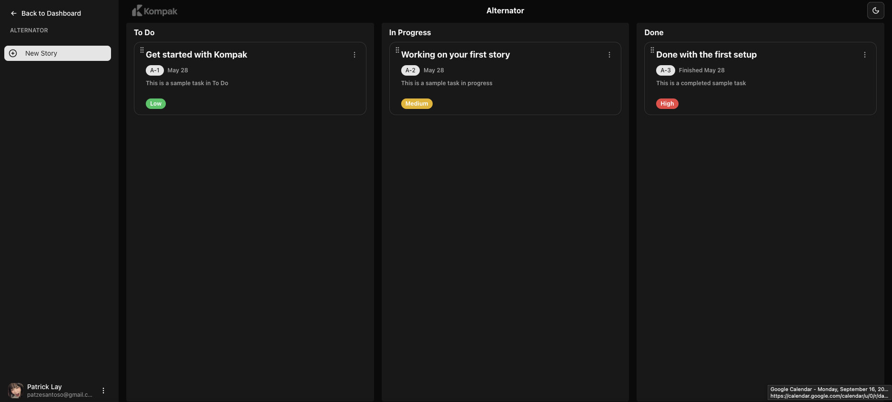

# Kompak

Kompak is a sleek, minimalistic project management tool inspired by Jira — designed to help you manage tasks, stories, and boards with simplicity and speed.

## 🚀 Features

- 🔐 Authentication with Supabase
- 🧩 Drag & drop task management
- 🗂 Create and manage boards and tasks
- 🎨 Dark mode UI
- 📊 Task priority and status indicators
- 📅 Auto-timestamping of task updates
- ⚙️ Board editing and story editing modals

---

## 📸 Preview

### 🏠 Homepage
  
The homepage introduces Kompak with call-to-action buttons and a hero visual of the app's interface.

### 🔐 Login Page
  
Users can log in using their email and password. This is powered by Supabase Auth.

### 📋 Dashboard (Board Overview)
  
Displays all boards created by the user, along with task counts and creation dates.

### ✏️ Edit Task Modal
  
Edit or delete a task card, modify its priority, status, title, and description — all in a convenient modal interface.

### 📌 Full Board View
  
Organize tasks into columns: To Do, In Progress, and Done. Each task shows priority, status, and creation/finish dates. Tasks are draggable.

---

## 🛠️ Tech Stack

- **Frontend:** Next.js 15, React 19, Tailwind CSS, Radix UI
- **Auth & Backend:** Supabase
- **Drag & Drop:** `@dnd-kit`
- **Other Tools:** Prisma, PostgreSQL, Lucide Icons, Vercel Deployment

---

## 📦 Installation

```bash
git clone https://github.com/PatrickZ3/Kompak.git
cd Kompak
npm install
npm run dev
